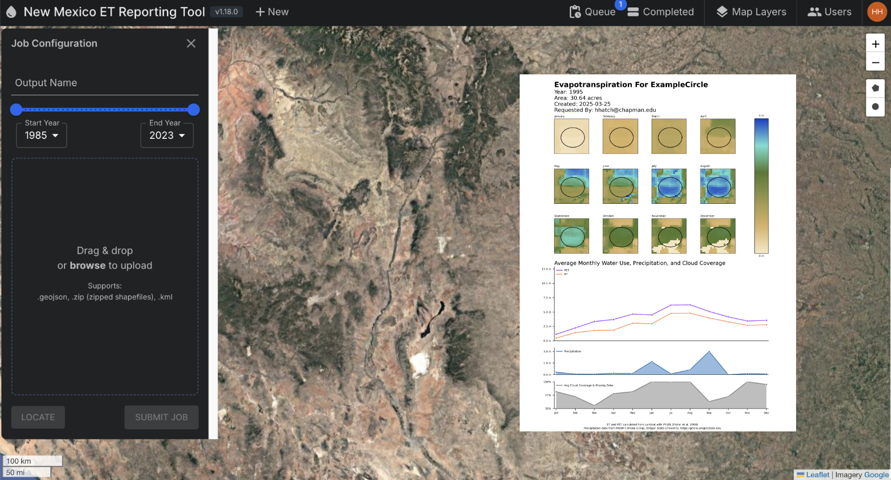

# ET Tool



The ET Reporting Tool is a React-based web application that allows users to explore Evapotranspiration (ET) data from OpenET, Landsat, MODIS, VIIRS, and other sources. The tool allows the generation of reports over dynamically specified areas as well as provides lower-resolution statewide data and is in use by the New Mexico Office of the State Engineer. The tool was developed in partnership between the NASA/Caltech Jet Propulsion Laboratory, Chapman University, and the New Mexico Office of the State Engineer under the NASA WATER program.

To request access, go to [https://et-tool.nm.gov](https://et-tool.nm.gov).

## Documentation

Please visit the [Wiki](https://github.com/New-Mexico-Water-Resources/ET-Tool/wiki/1.-What-is-the-New-Mexico-ET-Reporting-Tool%3F) for more information on the ET Tool.

## Architecture

The ET Tool is comprised of 6 main components:
- Frontend: A React-based web application that allows users to explore ET data.
- Backend: A Node.js Express server that serves the frontend and handles data processing.
- Report Job Runner: A Python script that generates ET reports on demand and stores them for later downloading from the frontend.
- Data Pipeline: A Python script that fetches MODIS and VIIRS data from NASA Earthdata, reprocesses, and stores it in S3 for dynamic use in the application.
- Tile Server: A FastAPI-based server that dynamically generates tiles for viewing in the frontend.
- MongoDB: A MongoDB database that stores ET jobs and user data.

Each major component of the application is managed in a respective Docker container and managed via a docker compose file.

## Development

To run the ET Tool locally, first spin up a local MongoDB instance. This can be done with docker by running:

```bash
docker run -d --name et-tool-mongo -p 27017:27017 mongo
```

Then, spin up the Frontend by navigating to the `client` directory and running:

```bash
yarn install
yarn dev
```

Next, spin up the Backend by navigating to the root directory and running:

```bash
npm install
npm run S3
```

After this, the queue monitoring script can be started by running:

```bash
pip install -r requirements.txt
AWS_PROFILE=ose-nmw python water_report_queue.py -v
```

Lastly, we can spin up the tile server by navigating to `tile_server` directory and running:

```bash
pip install -r requirements.txt
uvicorn main:app --reload --port 5001 
```

Once all of these components are running, the application should be accessible at [http://localhost:5173](http://localhost:5173).

**NOTE: Running these components requires a valid AWS profile with access to populated S3 bucket (named `ose-dev-inputs` in this case).**

## Fetching New Data

The tool uses data from multiple sources to generate ET reports and provide dynamic visualizations. The MODIS/VIIRS pipeline ensures this data is regularly updated. However, the following sources require manual updates:

- OpenET: The tool uses OpenET Ensemble data from Google Earth Engine. This must be periodically (yearly) fetched and stored in the S3 bucket.
- IDAHO_EPSCOR/GRIDMET: This data is also fetched from Google Earth Engine and stored in the S3 bucket. However, it is also available here: [https://www.climatologylab.org/gridmet.html](https://www.climatologylab.org/gridmet.html) and may be later configured to be fetched from there instead.
- PRISM: This data is separately fetched from the [PRISM website](https://prism.oregonstate.edu/) and stored in the S3 bucket.

In order to simplify the process of fetching new data, a Jupyter Notebook has been provided in the `pipelines` directory. This notebook can be used to fetch and store the data in the S3 bucket. Visit the [README](./pipelines/README.md) in the `pipelines` directory for more information.


## Contributors

- Ryan Stonebraker, Jet Propulsion Laboratory, [ryan.stonebraker@jpl.nasa.gov](mailto:ryan.stonebraker@jpl.nasa.gov)
- Gregory Halverson, Jet Propulsion Laboratory, [gregory.h.halverson@jpl.nasa.gov](mailto:gregory.h.halverson@jpl.nasa.gov)
- Josh Fisher, Chapman University
- Scott Davidoff, Space Science Institute
- Holland Hatch, Chapman University
- Ryan Joshi, Chapman University
- Mony Sea, California State University Northridge
- Annalise Jensen, Chapman University
- Zoe von Allmen, Chapman University

## Copyright

Copyright 2022, by the California Institute of Technology. ALL RIGHTS RESERVED. United States Government Sponsorship acknowledged. Any commercial use must be negotiated with the Office of Technology Transfer at the California Institute of Technology.
 
This software may be subject to U.S. export control laws. By accepting this software, the user agrees to comply with all applicable U.S. export laws and regulations. User has the responsibility to obtain export licenses, or other export authority as may be required before exporting such information to foreign countries or providing access to foreign persons.